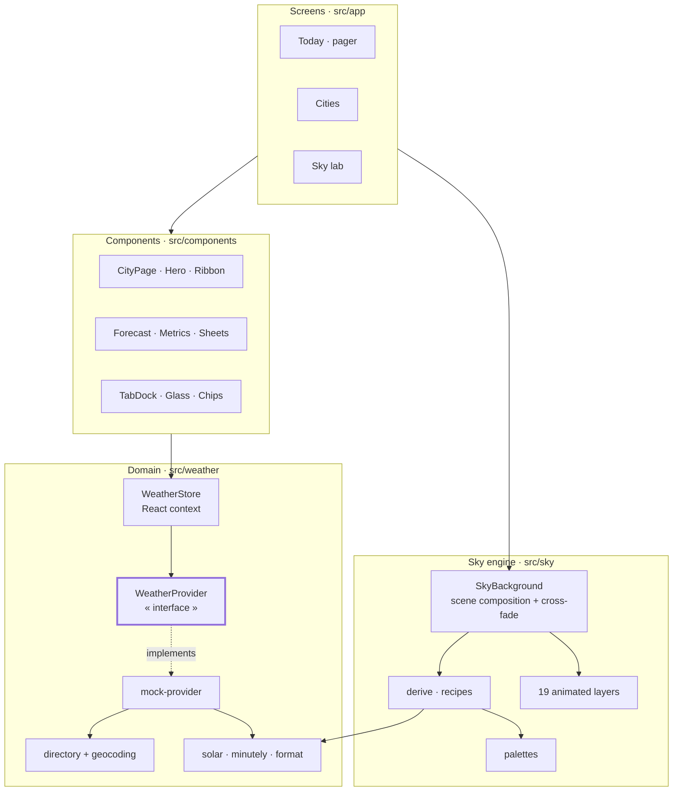
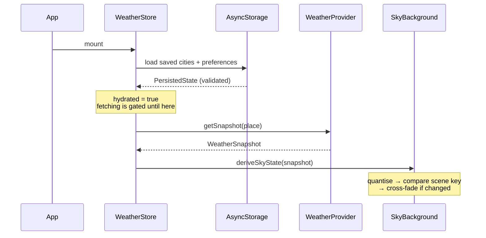

# Aurora — Architecture & Technical Documentation

A weather app for iOS, Android and web, built with Expo SDK 57 and React Native 0.86.
Its background is a **live simulation of the current weather** rather than a picture of
it: 14 conditions, each with day, golden-hour and night variants, composed from 19
independent animated layers and cross-faded into one another.

| | |
| --- | --- |
| **Platforms** | iOS, Android, Web (all bundle from one codebase) |
| **Expo SDK** | 57 · React Native 0.86.2 · React 19.2.3 |
| **Language** | TypeScript (strict) |
| **Source** | 45 source files (~10,100 lines) + 6 test files (~820 lines) |
| **Tests** | 88 across 6 suites |
| **Runs in Expo Go** | Yes — except location and sharing, which need a dev build |

```bash
npm install
npx expo start        # a=Android  i=iOS  w=web

npm test              # 88 tests
npm run typecheck     # tsc --noEmit
npm run lint          # expo lint
```

---

## 1. Overview

Most weather apps put a static gradient behind a stack of cards. Here the sky *is* the
app: content floats over a full-bleed simulation, scrolling reads as descending through
the atmosphere, and every saved city renders its own live weather inside its row.

### Screens

| Screen | Route | Purpose |
| --- | --- | --- |
| **Today** | `src/app/index.tsx` | Horizontal pager, one page per saved city |
| **Cities** | `src/app/cities.tsx` | Saved places, each with a live miniature sky; search; "use my location" |
| **Sky** | `src/app/sky.tsx` | Preview any condition on demand; quality, motion and unit settings |

### Features

**Weather**
- Current conditions, 24-hour ribbon, 10-day outlook, per-day detail sheet
- **Minute-by-minute precipitation** — "Rain stopping in 12 min"
- Yesterday comparison — "4° warmer than yesterday"
- Metrics: UV, wind compass, humidity, visibility, pressure, air quality, daylight arc
- Severe-weather alert banners

**Places**
- Multiple saved cities, swipe between them
- Search: bundled directory (India to district level) + key-free online geocoding
- Device location, pinned as "Current Location"
- Everything persists across launches

**The sky**
- 14 conditions × 4 day parts, cross-fading between states
- Rain, snow, sleet, hail, cumulus, fog, sun, crepuscular rays, stars, moon, lightning
  with screen rumble, aurora, heat shimmer, puddle ripples, wet glass, city-light
  reflections, frost, gusts, dust
- Sun and moon positioned on a real solar arc; moon shows its true phase
- Aurora on clear high-latitude nights

**Craft**
- Honours the OS reduce-motion setting
- Three quality tiers
- Draggable tab dock
- Shareable weather card

---

## 2. Architecture

Four layers, each depending only on the one below it.



Two rules hold the design together:

1. **Screens never see vendor JSON.** Everything passes through `WeatherProvider`.
2. **The sky never sees a `WeatherSnapshot`.** It consumes a `SkyState` — condition,
   day part, intensity, wind, temperature, sun progress, moon phase, latitude, seed.
   That's why the Sky lab can preview a thunderstorm at 3am that isn't happening
   anywhere.

### Data flow



---

## 3. How the sky works

The most involved part of the app, and the part worth understanding first.

### Condition → recipe → layers

A condition is not a single asset — it is a **composition**. `getSkyRecipe()`
(`src/sky/derive.ts`) turns a `SkyState` into a list of layers plus cloud parameters:

```ts
case 'thunderstorm':
  return {
    layers: ['clouds', 'rain', 'lightning', 'ripples', 'glassDrops',
             ...(night ? ['cityLights'] : [])],
    cloudiness: 1,
    cloudDarkness: 0.92,
  };
```

Because layers are independent, `rain` is the same component in a drizzle and a
hurricane — only `intensity` differs. Adding a condition is four small edits, not a new
renderer.

### Cross-fading between states

`SkyBackground` renders a **scene**: base gradient + golden-hour wash + layers + scrim +
vignette. When the weather changes, the incoming scene is mounted and faded up over the
outgoing one, so sunny → storm is a genuine blend of two live simulations. The outgoing
scene unmounts as soon as the fade lands, so both exist only during the transition.

Continuous inputs are **quantised** before reaching the layers (wind to 5 km/h, sun angle
to 1/50). Without it, a hundredth of a degree of sun movement would invalidate a memo and
re-seed 200 views mid-flight, visibly reshuffling the sky.

### The palette matrix

`src/sky/palettes.ts` defines a palette per condition for **day and night only**. Dawn
and dusk are not 28 more hand-tuned gradients — they reuse the day palette and are warmed
by `HORIZON_GLOW`, one wash composited over any condition. A new condition therefore
needs two entries, not four.

### Determinism

Every layer scatters its particles from a **seeded PRNG** (`src/lib/rng.ts`, mulberry32)
keyed on the place id. Same city, same sky — re-renders never reshuffle the field, and
London's raindrops fall in the same places every time.

---

## 4. Performance model

The hard constraint: hundreds of particles moving while the device scrolls a list.

### Everything loops natively

Rain, snow, clouds, stars, fog, lightning and the rest are **Reanimated 4 CSS keyframe
animations** (`animationName`, `animationDuration`, `animationIterationCount`), evaluated
on the native side. 160 raindrops cost **zero JavaScript per frame**. The same field built
from `useAnimatedStyle` would mean 160 worklet evaluations every frame.

```tsx
// src/sky/layers/precipitation.tsx
animationName: {
  from: { transform: [{ translateX: 0 }, { translateY: -h }, { rotate: `${deg}deg` }] },
  to:   { transform: [{ translateX: drift }, { translateY: height }, { rotate: `${deg}deg` }] },
},
animationDuration: drop.duration,
animationDelay: -rng() * drop.duration,   // negative — see below
animationIterationCount: 'infinite',
```

### Negative delays

Each particle gets a **negative `animationDelay`** — CSS semantics for "begin partway
through" — so the field is full on the very first frame instead of filling in over one
cycle. This is what makes a 90-second cloud drift viable at all.

### No live blur

`expo-blur` is installed but **deliberately unused**. A `BlurView` over a continuously
animating background re-blurs every frame — the single most expensive thing this app
could do. Glass surfaces are layered translucency plus a hairline sheen.

### Quality tiers

`QUALITY_SCALE` scales every particle count from one place:

| Tier | Multiplier | Used by |
| --- | --- | --- |
| `high` | 1.0 | Default |
| `balanced` | 0.62 | Manual |
| `battery` | 0.3 | City cards |

City cards run at `battery`, so five simultaneous simulations cost about as much as one
full-screen one.

### Soft edges everywhere

A recurring rule, learned the hard way: **a shape with a hard edge at partial opacity
reads as a bubble, a sticker or a stripe.** Clouds, sun corona, moon halo, fog banks and
heat shimmer all use radial gradients that fall to *fully* transparent at the rim. Cutting
any of those gradients short brings the artefact straight back.

### Structural stability

Two bugs came from changing the *shape* of the tree rather than its styles:

- The pager swapped children between a page and a placeholder, which made the browser
  re-evaluate its scroll-snap position mid-swipe. Page wrappers are now permanent and
  fixed-size; only their contents mount.
- `StormRumble` returned a fragment when inactive and a view when active, remounting the
  entire subtree — and resetting the pager's scroll — whenever the weather became a
  thunderstorm. It now always renders the wrapper and varies only the style.

---

## 5. Expo APIs used

Seven Expo packages are actually imported. Each entry lists where and why.

### `expo-router` — navigation

```ts
import { Tabs } from 'expo-router/js-tabs';        // src/app/_layout.tsx
import type { BottomTabBarProps } from 'expo-router/js-tabs';
import { useRouter } from 'expo-router';           // src/app/cities.tsx
```

File-based routing over `src/app`. The tab navigator uses a **custom `tabBar`** so the
sky stays continuous to the bottom of the screen — the dock floats over it rather than
cutting it off. Scene backgrounds are transparent for the same reason.

> `Tabs` from `expo-router` itself is deprecated in SDK 57; the supported path is
> `expo-router/js-tabs`, which is what this app imports.

Typed routes are enabled via `experiments.typedRoutes`.

### `expo-linear-gradient` — every gradient in the app

Used in 8 files. Sky base gradients, golden-hour wash, glass sheen, legibility scrim,
grounding vignette, temperature range bars, fog, city lights, the dock indicator and the
share card.

### `expo-haptics` — physical feedback

```ts
Haptics.impactAsync(Haptics.ImpactFeedbackStyle.Light | Medium)
Haptics.notificationAsync(Haptics.NotificationFeedbackType.Success | Warning)
Haptics.selectionAsync()
```

Unit toggle, tab selection and drag-crossings, pull-to-refresh, day-row taps, adding and
removing cities, page changes. **Every call is guarded with `Platform.OS !== 'web'`.**

### `expo-location` — device location

```ts
// src/weather/device-location.ts
Location.requestForegroundPermissionsAsync()
Location.getCurrentPositionAsync({ accuracy: Location.Accuracy.Balanced })
Location.reverseGeocodeAsync({ latitude, longitude })
```

- `Balanced` (~100m) — far more precision than a forecast needs, and it settles much
  faster than `High` on a cold start.
- Coordinates resolve to a place name through the **OS geocoder**: offline, no key, and
  better on small localities than a lookup service.
- `reverseGeocodeAsync` **does not exist on web**, so there the app falls back to the
  nearest known place's name while keeping the real coordinates.
- Devices often report `coords.altitude`, which feeds the elevation term in the climate
  model.

Configured in `app.json`:

```json
["expo-location", {
  "locationWhenInUsePermission": "Aurora uses your location to show the weather where you are…",
  "isAndroidBackgroundLocationEnabled": false
}]
```

### `expo-sharing` — share card

```ts
Sharing.isAvailableAsync()   // gates the button
Sharing.shareAsync(uri, { mimeType: 'image/png' })
```

### `expo-splash-screen` / `expo-status-bar` — chrome

`SplashScreen.hideAsync()` once the root layout mounts. `StatusBar style="light"` — the
sky is always dark enough behind it.

### Installed but not used

These arrived with the Expo template and are **not imported anywhere** in `src/`:

`@expo/ui` · `expo-blur` · `expo-constants` · `expo-device` · `expo-font` ·
`expo-glass-effect` · `expo-image` · `expo-linking` · `expo-symbols` · `expo-system-ui` ·
`expo-web-browser`

`expo-blur` is the deliberate one — see [No live blur](#no-live-blur). The rest are
simply unused and safe to remove.

---

## 6. Third-party libraries

| Library | Version | Role |
| --- | --- | --- |
| `react-native-reanimated` | 4.5.1 | Every animation. CSS keyframes, shared values, worklets, `useReducedMotion` |
| `react-native-svg` | 15.15.4 | Weather icons, gradients, curves, gauges, aurora paths, lightning bolts |
| `react-native-gesture-handler` | 2.32.0 | Tab dock drag + tap (`Gesture.Exclusive`) |
| `react-native-safe-area-context` | 5.7.0 | Insets on all three screens |
| `@react-native-async-storage/async-storage` | 2.2.0 | Persistence |
| `react-native-view-shot` | 5.1.0 | Rendering the share card to PNG |
| `react-native-worklets` | 0.10.1 | Reanimated 4 peer requirement |

### Notable Reanimated usage

- **CSS keyframe animations** — all particle motion (native, zero JS/frame)
- `useAnimatedScrollHandler` — hero parallax, pager position, sky parallax
- `useAnimatedProps` — SVG `strokeDashoffset` reveals on the hourly curve and metric rings
- `useReducedMotion` — the OS accessibility setting
- `Gesture.Exclusive(pan, tap)` — dock; taps live in the gesture system so RN's separate
  responder system can't override a drag

---

## 7. The data layer

### The seam

`WeatherProvider` (`src/weather/provider.ts`) is the single boundary between the app and
any weather vendor:

```ts
export interface WeatherProvider {
  readonly id: string;
  readonly label: string;
  searchPlaces(query: string, signal?: AbortSignal): Promise<Place[]>;
  reverseGeocode(coordinates: Coordinates, signal?: AbortSignal): Promise<Place>;
  getSnapshot(place: Place, signal?: AbortSignal): Promise<WeatherSnapshot>;
}
```

**To plug in a live API**, write an adapter and change one line in
`src/weather/index.ts`:

```ts
export const weatherProvider: WeatherProvider = myApiProvider;
```

Nothing else imports the provider.

`src/weather/condition-codes.ts` already maps **WMO 4677** codes (Open-Meteo, DWD, most
national services), **OpenWeatherMap** condition IDs and free-text summaries onto the
app's `WeatherCondition` vocabulary — usually the fiddliest part of an adapter.

Temperatures are **always Celsius in the model**; conversion happens at the render edge,
so an adapter never needs to know the user's unit preference.

### The store

`src/weather/store.tsx` — React context holding places, per-place snapshot cache,
preferences, hydration state and location status.

- Snapshots are cached per place id, so switching cities is instant and a revisit never
  shows a spinner
- One in-flight request per place; a second call is a no-op, not a duplicate fetch
- Snapshots older than 10 minutes refetch when a place becomes visible
- **Fetching waits for hydration**, or the defaults would be fetched and then discarded
- **Writes are blocked until the read completes**, or the defaults would overwrite saved
  cities on launch
- Persisted data is validated on read and discarded if malformed; preferences merge over
  defaults so a setting added later is never missing
- Snapshots are deliberately *not* persisted — weather is stale within minutes

### Place search

Two layers, both needed:

1. **`src/weather/directory.ts`** — bundled list; instant, works offline
2. **`src/weather/geocoding.ts`** — Open-Meteo geocoding; free, **no API key**, indexes
   small localities worldwide

Open-Meteo has Nagercoil but returns *nothing* for Kanyakumari, which is why the bundled
list is not merely a cache. Set `ONLINE_GEOCODING = false` to go fully offline; any
network failure already degrades to that silently.

### The mock

`src/weather/mock-provider.ts` generates coherent, deterministic data for **any** place:

- **Annual mean by latitude** — a fitted curve, not a straight line: flat across the
  tropics, falling away sharply toward the poles
- **Seasonal swing** scaled by latitude, phase-flipped by hemisphere
- **Elevation** at 5.5°C/km, capped at 14°C
- Diurnal curve anchored to that location's real sunrise
- Conditions persist in runs rather than flickering hour to hour

Checked against real late-July means it lands within ~2°C for Chennai, Nagercoil,
Bengaluru, Darjeeling, Kodaikanal, London, Oslo, Melbourne and Sydney. It does **not**
model continentality, so hot inland plains such as Delhi read a few degrees cool.

### Supporting modules

| Module | Contains |
| --- | --- |
| `solar.ts` | Sunrise/sunset from latitude and date, incl. polar day/night; moon phase |
| `minutely.ts` | Turns 60 intensity readings into one sentence |
| `format.ts` | Units, timezone-correct clocks, compass points, yesterday comparison |
| `directory.ts` | Bundled places with elevation |
| `geocoding.ts` | Online lookup + IANA-zone → UTC-offset resolution |

**City clocks use offset arithmetic, not `Intl.DateTimeFormat({ timeZone })`.** Hermes'
ICU coverage varies by platform and build, and a city clock silently falling back to
device-local time is a bug nobody reports but everybody feels.

---

## 8. Directory map

```
src/
  app/                    Routes (expo-router)
    _layout.tsx           Providers, Tabs with custom tabBar
    index.tsx             Today — city pager
    cities.tsx            Saved cities, search, location
    sky.tsx               Condition preview + settings

  sky/                    The animated background
    types.ts              SkyState, SkyPalette, quality tiers
    palettes.ts           Gradient matrix + golden-hour wash
    derive.ts             Snapshot → SkyState; condition → layer recipe
    sky-background.tsx    Scene composition, cross-fade, parallax
    use-sky.ts            Slow clock; live sky state
    layers/
      shared.ts           LayerProps, colour helpers, storm period
      precipitation.tsx   rain · snow · sleet · hail
      clouds.tsx          cumulus masses · fog banks
      celestial.tsx       sun · rays · stars · moon
      aurora.tsx          high-latitude curtains
      effects.tsx         lightning · rumble · shimmer · ripples ·
                          wet glass · city lights · frost · gusts · dust

  weather/                Domain
    types.ts              The model everything renders from
    provider.ts           « interface » — the seam
    index.ts              Active provider  ← one line to swap
    mock-provider.ts      Deterministic generator
    condition-codes.ts    WMO / OpenWeather / text → condition
    directory.ts          Bundled places
    geocoding.ts          Online place lookup
    device-location.ts    expo-location wrapper
    solar.ts              Sun and moon maths
    minutely.ts           Next-hour summary
    format.ts             Display formatting
    store.tsx             App state + persistence

  components/             UI kit  (16 files)
  design/tokens.ts        Spacing, glass, type scale, temperature ramp
  lib/                    rng.ts (seeded PRNG) · storage.ts
```

---

## 9. Testing

88 tests, 6 suites, via `jest-expo`. They cover the **pure logic**, which is where every
silent bug has been:

| Suite | Covers |
| --- | --- |
| `solar.test.ts` | Sunrise/sunset, polar day and night, local midnight, moon phase |
| `format.test.ts` | Unit conversion, timezone clocks, compass, yesterday comparison |
| `condition-codes.test.ts` | WMO, OpenWeather, free-text mapping |
| `minutely.test.ts` | Start/stop detection, sustain rule, headlines |
| `mock-provider.test.ts` | Climate model vs real temperatures, snapshot coherence |
| `derive.test.ts` | Day-part boundaries, layer recipes, aurora gating |

Two are **regression tests for bugs that shipped**:

- **Ooty vs Coimbatore** — two degrees of latitude apart, 2.2km of altitude. Locks in the
  elevation term; without it Ooty reported 28°C instead of ~15°C.
- **Shimmer on a cold clear day** — locks in temperature, not UV index, as the trigger.
  UV is high on a cold bright mountain day, so the original gate drew heat haze over it.

---

## 10. Known limitations

- **Location and sharing need a development build.** Both no-op in Expo Go and on web.
- **The mock ignores continentality**, so hot inland plains read a few degrees cool.
- **Heat shimmer is an approximation.** Without a shader there is no true refraction; it
  is tuned to sit near the threshold of visibility rather than fake it badly.
- **Fast multi-page swipes** may briefly show a blank page — only the neighbouring cities
  are kept mounted.
- **Portrait only** (`app.json`), and there is no tablet-specific layout.
- No widgets, notifications or background refresh — all need native modules and a real
  API with background capability.

---

## 11. Build notes

### Why `@emnapi/*` is in devDependencies

`@emnapi/core`, `@emnapi/runtime` and `@emnapi/wasi-threads` are pinned as explicit
devDependencies. **They are not used by any code in this repo** — do not remove them
expecting nothing to happen.

They exist to work around an npm lockfile bug. The chain is:

```
eslint-config-expo → eslint-import-resolver-typescript → unrs-resolver
  → @unrs/resolver-binding-wasm32-wasi   (optional)
    → @emnapi/core, @emnapi/runtime, @emnapi/wasi-threads
```

Running `npm install` on Windows writes all 33 `@unrs/resolver-binding-*` platform
packages into the lock but **drops their transitive dependencies**. `npm ci` validates
the *entire* lock tree — including entries it would never install on the current
platform — so it then fails everywhere with:

```
npm error `npm ci` can only install packages when your package.json and
npm error package-lock.json are in sync.
npm error Missing: @emnapi/core@1.10.0 from lock file
```

EAS Build runs `npm ci --include=dev`, so this fails the cloud build while everything
works locally. Declaring the three packages explicitly forces npm to write the entries.

Reproduce the check locally before pushing a build:

```bash
npm ci --include=dev --dry-run
```

If a future npm or `eslint-config-expo` fixes the underlying resolution, these three
lines can go — but only if that command still passes without them.

### Android build targets

Values below come from the generated Gradle project (`expo prebuild`), not from
guesswork — the SDK levels are defaults supplied by the `expo-root-project` plugin
rather than anything set in `app.json`.

| | |
| --- | --- |
| `minSdkVersion` | **24** (Android 7.0 Nougat) |
| `targetSdkVersion` / `compileSdkVersion` | **36** (Android 16) |
| Architectures | `arm64-v8a`, `armeabi-v7a` |
| New Architecture | Enabled (required by RN 0.86) |
| JS engine | Hermes |

`x86` and `x86_64` are excluded via `expo-build-properties`' `buildArchs`. That halved
the APK — but it also means **preview builds will not install on a standard Android
emulator**, which is x86_64. Use the `development` profile, or temporarily restore the
full architecture list, when you need one.

Combined with removing five unused native modules, the APK went from 111.7 MB to
56.4 MB. The remainder is close to the floor for this stack: Hermes, React Native core,
Reanimated, SVG and gesture-handler amount to roughly 25–30 MB of native libraries per
architecture, and two architectures ship here.

### EAS profiles

`eas.json` defines three: `development` (dev client, internal), `preview` (internal) and
`production` (auto-incrementing version). `preview` needs
`"android": { "buildType": "apk" }` to produce something installable — AABs cannot be
installed directly on a device.

---

## 12. Extending

### Add a weather condition

1. Add it to `WeatherCondition` and `CONDITION_LABEL` in `weather/types.ts`
2. Add day and night palettes in `sky/palettes.ts` (golden hour is handled generically)
3. Add a case to `getSkyRecipe` in `sky/derive.ts`
4. Add a glyph in `components/weather-icon.tsx`

It appears in the Sky lab's picker automatically.

### Add a sky layer

1. Create it in `sky/layers/`, taking `LayerProps`
2. Add its name to `SkyLayerName` in `sky/derive.ts`
3. Register it in `LAYER_COMPONENTS` in `sky/sky-background.tsx`
4. Reference it from the recipes that should use it

Layers must honour `motion` (render a still frame when false) and scale their particle
counts through `scaleCount(base, quality)`.
